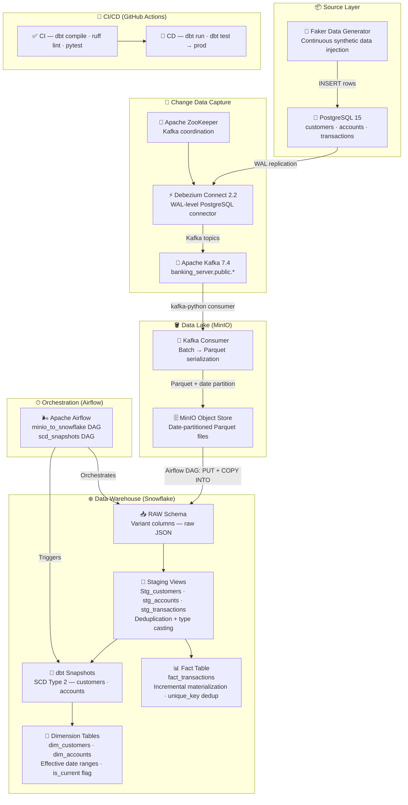
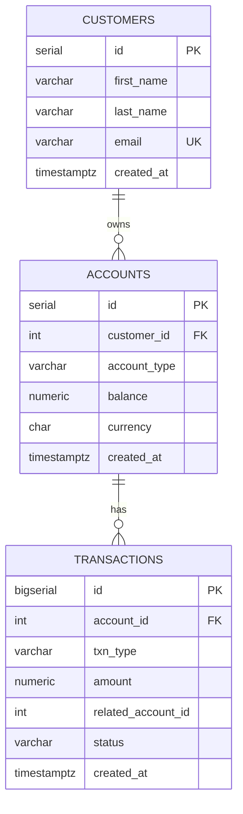
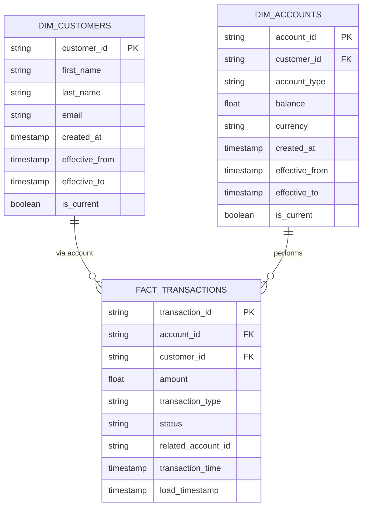
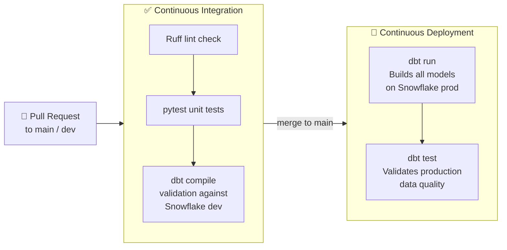

<div align="center">

<br/>

```
██╗     ███████╗██████╗  ██████╗ ███████╗██████╗ ███████╗██╗      ██████╗ ██╗    ██╗
██║     ██╔════╝██╔══██╗██╔════╝ ██╔════╝██╔══██╗██╔════╝██║     ██╔═══██╗██║    ██║
██║     █████╗  ██║  ██║██║  ███╗█████╗  ██████╔╝█████╗  ██║     ██║   ██║██║ █╗ ██║
██║     ██╔══╝  ██║  ██║██║   ██║██╔══╝  ██╔══██╗██╔══╝  ██║     ██║   ██║██║███╗██║
███████╗███████╗██████╔╝╚██████╔╝███████╗██║  ██║██║     ███████╗╚██████╔╝╚███╔███╔╝
╚══════╝╚══════╝╚═════╝  ╚═════╝ ╚══════╝╚═╝  ╚═╝╚═╝     ╚══════╝ ╚═════╝  ╚══╝╚══╝
```

### **Real-Time Banking Data Platform · CDC · Data Warehouse · Dimensional Modelling**

<br/>

[](https://www.python.org/)
[](https://kafka.apache.org/)
[](https://debezium.io/)
[](https://airflow.apache.org/)
[](https://www.getdbt.com/)
[](https://www.snowflake.com/)
[](https://www.postgresql.org/)
[](https://www.docker.com/)
[](https://github.com/features/actions)
[](LICENSE)

<br/>

> **LedgerFlow** is a production-grade, event-driven banking analytics platform that captures every database change in real time using **Change Data Capture**, streams events through **Apache Kafka**, stages data in a **MinIO data lake**, and serves analytics-ready dimensional models in **Snowflake** — fully orchestrated by **Apache Airflow** and continuously deployed via **GitHub Actions CI/CD**.

<br/>

</div>

---

## Table of Contents

- [Product Overview](#-product-overview)
- [Architecture](#-system-architecture)
- [Data Flow](#-data-flow)
- [Repository Structure](#-repository-structure)
- [Technology Stack](#-technology-stack)
- [Data Model](#-data-model)
- [Pipeline Stages](#-pipeline-stages)
- [Installation](#-installation)
- [Quick Start](#-quick-start)
- [Configuration](#-configuration)
- [Sample Outputs](#-sample-outputs)
- [Engineering Decisions](#-engineering-decisions)
- [CI/CD Pipeline](#-cicd-pipeline)
- [Roadmap](#-roadmap)

---

## 🏦 Product Overview

### The Problem

Traditional banking analytics pipelines are batch-oriented, brittle, and disconnected. Data engineers cobble together cron jobs, fragile scripts, and ad-hoc SQL against production databases — creating systems that delay insights by hours, break under schema changes, and offer no auditability.

### The Solution

LedgerFlow implements a **modern data stack** grounded in three architectural principles:

| Principle | Implementation |
|---|---|
| **Event-Driven Ingestion** | Debezium CDC captures every `INSERT`, `UPDATE`, `DELETE` from PostgreSQL at the WAL level — zero impact on the source system |
| **Immutable Staging** | Kafka consumers serialize events to Parquet and land them in MinIO, creating a durable, replayable data lake |
| **Governed Transformations** | dbt models enforce SCD Type 2 history, deduplication, and dimensional modelling on Snowflake — with CI-gated deployments |

### Business Value

- **Zero-latency data capture** — every transaction is reflected in the warehouse within minutes
- **Full historical auditability** — SCD Type 2 snapshots on customers and accounts preserve every state change
- **Schema-decoupled pipelines** — Debezium absorbs upstream schema drift; consumers remain stable
- **Reproducible deployments** — CI validates dbt compilation on every PR; CD deploys to Snowflake on merge to `main`

### Target Users

- **Data Engineers** building event-driven ingestion pipelines
- **Analytics Engineers** working with dbt and dimensional modelling
- **Platform Engineers** evaluating Kafka + Debezium CDC architectures
- **Engineering Managers** benchmarking modern data stack patterns

---

## 🏗 System Architecture



---

## 🌊 Data Flow

```mermaid
flowchart LR
    A["🗃 PostgreSQL\nSource of Truth"] -->|WAL / pgoutput| B["⚡ Debezium\nCDC Connector"]
    B -->|JSON events\nbefore + after payloads| C["📨 Kafka Topics\nbanking_server.public.*"]
    C -->|kafka-python\nbatch consumer| D["📦 Parquet Files\nbatch_size=50 records"]
    D -->|boto3\nS3-compatible PUT| E["🗄 MinIO\ntable/date=YYYY-MM-DD/*.parquet"]
    E -->|Airflow DAG\nPUT → COPY INTO| F["❄️ Snowflake RAW\nVariant columns"]
    F -->|dbt staging views\ndedup + cast| G["🔄 Staging Layer"]
    G -->|dbt snapshots\nSCD Type 2| H["📐 Dimensions\ndim_customers\ndim_accounts"]
    G -->|dbt incremental\nunique_key dedup| I["📊 Fact Table\nfact_transactions"]
    H & I -->|Analytics queries| J["📈 Business Intelligence\nReporting · Dashboards"]
```



---

## 📁 Repository Structure

```
ledgerflow/
│
├── .github/
│   └── workflows/
│       ├── ci.yml                  # PR validation: lint, test, dbt compile
│       └── cd.yml                  # Merge to main: dbt run + test → Snowflake prod
│
├── banking_dbt/                    # dbt project — all transformation logic
│   ├── dbt_project.yml             # Project config, materialization defaults
│   ├── models/
│   │   ├── sources.yml             # Snowflake RAW source declarations
│   │   ├── staging/                # Deduplication views over RAW Variant columns
│   │   │   ├── stg_customers.sql
│   │   │   ├── stg_accounts.sql
│   │   │   └── stg_transactions.sql
│   │   └── marts/
│   │       ├── dimensions/         # SCD Type 2 dimension tables
│   │       │   ├── dim_customers.sql
│   │       │   └── dim_accounts.sql
│   │       └── facts/
│   │           └── fact_transactions.sql   # Incremental, unique_key dedup
│   └── snapshots/                  # dbt snapshots — SCD Type 2 strategy
│       ├── customers_snapshot.sql
│       └── accounts_snapshot.sql
│
├── consumer/
│   └── kafka_to_minio.py           # Kafka consumer → Parquet → MinIO
│
├── data-generator/
│   └── faker_generator             # Faker-based synthetic transaction engine
│
├── docker/
│   └── dags/
│       ├── minio_to_snowflake_dag.py   # Airflow: MinIO download → Snowflake COPY
│       └── scd_snapshots.py            # Airflow: daily dbt snapshot + marts run
│
├── kafka-debezium/
│   └── generate_and_post_connector.py  # Debezium REST API connector registration
│
├── postgres/
│   └── schema.sql                  # Source schema: customers, accounts, transactions
│
├── docker-compose.yml              # Full local stack: ZooKeeper, Kafka, Debezium,
│                                   #   PostgreSQL, MinIO, Airflow (webserver + scheduler)
├── dockerfile-airflow.dockerfile   # Custom Airflow image with dbt-snowflake
├── requirements.txt                # Python dependencies (grouped by component)
└── README.md
```

---

## 🛠 Technology Stack

| Layer | Technology | Version | Purpose |
|---|---|---|---|
| **Source Database** | PostgreSQL | 15 | Transactional source with WAL logical replication enabled |
| **CDC Engine** | Debezium | 2.2 | Captures row-level changes from PostgreSQL WAL via pgoutput plugin |
| **Message Bus** | Apache Kafka | 7.4 (Confluent) | Durable, ordered event stream per table |
| **Coordination** | Apache ZooKeeper | — | Kafka broker coordination |
| **Stream Consumer** | kafka-python + boto3 | Latest | Batch consumer serializing events to Parquet |
| **Data Serialization** | Apache Parquet (fastparquet) | Latest | Columnar, compressed, date-partitioned file format |
| **Object Storage** | MinIO | Latest | S3-compatible local data lake |
| **Orchestration** | Apache Airflow | 2.x | DAG-based pipeline scheduling and monitoring |
| **Data Warehouse** | Snowflake | — | Cloud-native analytical warehouse (COPY INTO from staged Parquet) |
| **Transformations** | dbt (dbt-snowflake) | Latest | SQL-first transformations, testing, and documentation |
| **Data Generation** | Faker + psycopg2 | Latest | Continuous synthetic banking data injection |
| **CI/CD** | GitHub Actions | — | PR validation and production deployment automation |
| **Containerisation** | Docker + Docker Compose | — | Full local stack with 8 services |
| **Linting** | Ruff | Latest | Python code quality enforcement in CI |

---

## 📐 Data Model

### Source Schema (PostgreSQL)



### Analytical Data Model (Snowflake — dbt Marts)



**Materialisation strategy:**

| Model | Materialisation | Key Detail |
|---|---|---|
| `stg_*` | View | Deduplication via `ROW_NUMBER() OVER (PARTITION BY id ORDER BY created_at DESC)` — always latest row per key |
| `customers_snapshot` | Snapshot (SCD2) | `check` strategy on `first_name`, `last_name`, `email` |
| `accounts_snapshot` | Snapshot (SCD2) | `check` strategy on `customer_id`, `account_type`, `balance` |
| `dim_customers` | Table | Reads snapshot; exposes `effective_from`, `effective_to`, `is_current` |
| `dim_accounts` | Table | Reads snapshot; exposes `effective_from`, `effective_to`, `is_current` |
| `fact_transactions` | Incremental | `unique_key='transaction_id'` — safe for repeated DAG runs |

---

## ⚙️ Pipeline Stages

```
╔══════════════════════════════════════════════════════════════════════╗
║  STAGE 1 — GENERATE          Faker injects synthetic customers,      ║
║                               accounts, and transactions into        ║
║                               PostgreSQL every 2 seconds             ║
╠══════════════════════════════════════════════════════════════════════╣
║  STAGE 2 — CAPTURE           Debezium reads PostgreSQL WAL via       ║
║                               pgoutput plugin; publishes JSON         ║
║                               before/after payloads to Kafka topics   ║
╠══════════════════════════════════════════════════════════════════════╣
║  STAGE 3 — STREAM            kafka-python consumer batches 50        ║
║                               records, serialises to Parquet,         ║
║                               uploads to MinIO with date partition    ║
╠══════════════════════════════════════════════════════════════════════╣
║  STAGE 4 — STAGE             Airflow DAG (every minute) downloads    ║
║                               Parquet from MinIO, stages via PUT,     ║
║                               loads into Snowflake RAW via COPY INTO  ║
╠══════════════════════════════════════════════════════════════════════╣
║  STAGE 5 — SNAPSHOT          Airflow DAG (daily) runs dbt snapshot   ║
║                               — SCD Type 2 history captured for       ║
║                               customers and accounts                  ║
╠══════════════════════════════════════════════════════════════════════╣
║  STAGE 6 — TRANSFORM         dbt builds staging views (dedup),        ║
║                               dimension tables (SCD2 from snapshots), ║
║                               and incremental fact_transactions        ║
╠══════════════════════════════════════════════════════════════════════╣
║  STAGE 7 — SERVE             Snowflake ANALYTICS schema exposes       ║
║                               dim_customers, dim_accounts,            ║
║                               fact_transactions to BI tools           ║
╚══════════════════════════════════════════════════════════════════════╝
```

---

## 🔑 KPI Surface

The warehouse layer directly supports the following analytical KPIs:

| KPI | Source Model | Calculation |
|---|---|---|
| **Total Transaction Volume** | `fact_transactions` | `SUM(amount)` |
| **Transaction Count by Type** | `fact_transactions` | `COUNT(*) GROUP BY transaction_type` |
| **Active Accounts** | `dim_accounts` | `COUNT(*) WHERE is_current = TRUE` |
| **Account Balance Distribution** | `dim_accounts` | `AVG / PERCENTILE_CONT(balance)` |
| **Customer Account Holdings** | `dim_customers` ⋈ `dim_accounts` | Accounts per customer |
| **Transaction Success Rate** | `fact_transactions` | `COUNT(*) WHERE status='COMPLETED' / COUNT(*)` |
| **Customer Acquisition Rate** | `dim_customers` | `COUNT(*) GROUP BY DATE(created_at)` |
| **SAVINGS vs CHECKING Split** | `dim_accounts` | `COUNT(*) GROUP BY account_type` |
| **Transfer Flow** | `fact_transactions` | `WHERE transaction_type = 'TRANSFER'` |
| **Historical Balance Changes** | `dim_accounts` (SCD2) | Balance delta via `effective_from` / `effective_to` |

---

## 💻 Installation

### Prerequisites

| Requirement | Version |
|---|---|
| Docker Desktop | ≥ 24.x |
| Docker Compose | ≥ 2.x |
| Python | 3.11 |
| Snowflake account | Any tier |
| Git | Any |

### 1. Clone the repository

```bash
git clone https://github.com/<your-username>/ledgerflow.git
cd ledgerflow
```

### 2. Configure environment variables

```bash
cp .env.example .env
# Edit .env with your credentials (see Configuration section)
```

### 3. Spin up the full local stack

```bash
docker compose up -d
```

This starts **8 services**: ZooKeeper, Kafka, Debezium Connect, PostgreSQL, MinIO, Airflow Webserver, Airflow Scheduler, and the Airflow metadata PostgreSQL instance.

### 4. Initialise PostgreSQL schema

```bash
docker exec -i $(docker ps -qf "name=postgres") psql -U $POSTGRES_USER -d $POSTGRES_DB < postgres/schema.sql
```

### 5. Register the Debezium connector

```bash
pip install -r requirements.txt
python kafka-debezium/generate_and_post_connector.py
```

### 6. Install Python dependencies

```bash
python -m venv .venv
source .venv/bin/activate          # Windows: .venv\Scripts\activate
pip install -r requirements.txt
pip install dbt-snowflake
```

### 7. Configure dbt profile

```bash
mkdir -p ~/.dbt
cat > ~/.dbt/profiles.yml << 'EOF'
banking_dbt:
  target: dev
  outputs:
    dev:
      type: snowflake
      account: <your_account>
      user: <your_user>
      password: <your_password>
      role: ACCOUNTADMIN
      database: BANKING
      warehouse: <your_warehouse>
      schema: ANALYTICS
EOF
```

---

## ⚡ Quick Start

```bash
# 1. Clone and configure
git clone https://github.com/<your-username>/ledgerflow.git && cd ledgerflow
cp .env.example .env  # fill in credentials

# 2. Start all services
docker compose up -d

# 3. Register CDC connector (once)
python kafka-debezium/generate_and_post_connector.py

# 4. Start generating data
python data-generator/faker_generator

# 5. Start the Kafka consumer (separate terminal)
python consumer/kafka_to_minio.py

# 6. Access Airflow UI at http://localhost:8080
#    Enable both DAGs: minio_to_snowflake_banking and SCD2_snapshots

# 7. Run dbt manually (optional)
cd banking_dbt && dbt run && dbt test
```

**Expected output from the data generator:**

```
--- Iteration 1 started ---
✅ Generated 10 customers, 20 accounts, 50 transactions.
--- Iteration 1 finished ---
--- Iteration 2 started ---
...
```

**Expected output from the Kafka consumer:**

```
✅ Connected to Kafka. Listening for messages...
[banking_server.public.transactions] -> {'id': 1, 'account_id': 3, ...}
✅ Uploaded 50 records to s3://banking-lake/transactions/date=2025-01-15/transactions_143022123456.parquet
```

---

## 🔧 Configuration

All secrets are managed via environment variables. Create a `.env` file at the project root:

```dotenv
# ── PostgreSQL (Source) ──────────────────────────────
POSTGRES_HOST=localhost
POSTGRES_PORT=5432
POSTGRES_USER=banking_user
POSTGRES_PASSWORD=<your_password>
POSTGRES_DB=banking

# ── Kafka ────────────────────────────────────────────
KAFKA_BOOTSTRAP=localhost:29092
KAFKA_GROUP=banking-consumer-group

# ── MinIO (Data Lake) ────────────────────────────────
MINIO_ENDPOINT=http://localhost:9000
MINIO_ACCESS_KEY=<your_access_key>
MINIO_SECRET_KEY=<your_secret_key>
MINIO_BUCKET=banking-lake
MINIO_LOCAL_DIR=/tmp/minio_downloads

# ── Snowflake (Warehouse) ────────────────────────────
SNOWFLAKE_ACCOUNT=<orgname>-<accountname>
SNOWFLAKE_USER=<your_user>
SNOWFLAKE_PASSWORD=<your_password>
SNOWFLAKE_WAREHOUSE=COMPUTE_WH
SNOWFLAKE_DB=BANKING
SNOWFLAKE_SCHEMA=RAW

# ── Airflow Metadata DB ──────────────────────────────
AIRFLOW_DB_USER=airflow
AIRFLOW_DB_PASSWORD=<your_password>
AIRFLOW_DB_NAME=airflow
```

**GitHub Actions Secrets** (required for CI/CD):

| Secret | Purpose |
|---|---|
| `SNOWFLAKE_ACCOUNT` | Snowflake account identifier |
| `SNOWFLAKE_USER` | Snowflake username |
| `SNOWFLAKE_PASSWORD` | Snowflake password |
| `SNOWFLAKE_WAREHOUSE` | Compute warehouse name |
| `POSTGRES_USER` | PostgreSQL user (CI service container) |
| `POSTGRES_PASSWORD` | PostgreSQL password (CI service container) |

---

## 📊 Sample Outputs

### Staging view — deduplicated customers

```sql
SELECT customer_id, first_name, last_name, email, created_at
FROM BANKING.ANALYTICS.STG_CUSTOMERS
LIMIT 5;
```

```
CUSTOMER_ID │ FIRST_NAME │ LAST_NAME  │ EMAIL                     │ CREATED_AT
────────────┼────────────┼────────────┼───────────────────────────┼─────────────────────
1           │ James      │ Rodriguez  │ jrodriguez@email.com      │ 2025-01-15 09:12:01
2           │ Sarah      │ Mitchell   │ smitchell@domain.net      │ 2025-01-15 09:12:01
3           │ David      │ Okafor     │ dokafor@mail.org          │ 2025-01-15 09:12:03
```

### Fact table — transaction analytics

```sql
SELECT
    transaction_type,
    COUNT(*)          AS txn_count,
    SUM(amount)       AS total_volume,
    AVG(amount)       AS avg_amount
FROM BANKING.ANALYTICS.FACT_TRANSACTIONS
GROUP BY 1
ORDER BY 2 DESC;
```

```
TRANSACTION_TYPE │ TXN_COUNT │ TOTAL_VOLUME  │ AVG_AMOUNT
─────────────────┼───────────┼───────────────┼───────────
DEPOSIT          │     1,842 │  921,043.50   │   500.02
WITHDRAWAL       │     1,791 │  896,210.00   │   500.39
TRANSFER         │     1,767 │  884,123.75   │   500.35
```

### SCD Type 2 — account history

```sql
SELECT account_id, balance, effective_from, effective_to, is_current
FROM BANKING.ANALYTICS.DIM_ACCOUNTS
WHERE account_id = '42'
ORDER BY effective_from;
```

```
ACCOUNT_ID │ BALANCE   │ EFFECTIVE_FROM       │ EFFECTIVE_TO         │ IS_CURRENT
───────────┼───────────┼──────────────────────┼──────────────────────┼───────────
42         │  250.00   │ 2025-01-15 08:00:00  │ 2025-01-16 14:23:01  │ FALSE
42         │  875.50   │ 2025-01-16 14:23:01  │ 2025-01-18 09:11:44  │ FALSE
42         │  620.25   │ 2025-01-18 09:11:44  │ NULL                 │ TRUE
```

---

## 🧠 Engineering Decisions

<details>
<summary><strong>Why Debezium for CDC instead of polling?</strong></summary>

Polling-based ingestion requires `updated_at` columns, misses hard deletes, and creates load on the source database. Debezium reads directly from PostgreSQL's **Write-Ahead Log (WAL)** using the native `pgoutput` replication plugin — zero additional database load, complete capture of all DML operations, and sub-second latency.

</details>

<details>
<summary><strong>Why Kafka as the event bus?</strong></summary>

Kafka decouples the producer (Debezium) from the consumer (MinIO writer), providing durability, replay capability, and horizontal scalability. If the consumer goes down, events accumulate safely in Kafka. The `auto_offset_reset='earliest'` setting ensures no data loss on consumer restart.

</details>

<details>
<summary><strong>Why Parquet in MinIO instead of CSV or JSON?</strong></summary>

Parquet is **columnar**, **compressed**, and **schema-aware** — typically 5–10x smaller than equivalent CSV. MinIO provides an S3-compatible API that integrates natively with Snowflake's `COPY INTO` command via `FILE_FORMAT=(TYPE=PARQUET)`. Date-based partitioning (`date=YYYY-MM-DD`) enables Airflow to process only new files incrementally.

</details>

<details>
<summary><strong>Why dbt Snapshots for SCD Type 2?</strong></summary>

dbt's `snapshot` command implements SCD Type 2 through its `check` strategy — comparing specified columns between runs and inserting new rows with `dbt_valid_from` / `dbt_valid_to` when values change. This eliminates custom merge logic, is idempotent, and integrates with dbt's DAG and testing framework.

</details>

<details>
<summary><strong>Why incremental materialisation for fact_transactions?</strong></summary>

Banking transaction tables grow continuously. A full refresh on every dbt run would process millions of rows unnecessarily. The `incremental` materialisation with `unique_key='transaction_id'` allows dbt to `MERGE` only new records into the fact table — dramatically reducing compute and cost on Snowflake.

</details>

<details>
<summary><strong>Why Snowflake Variant columns in RAW?</strong></summary>

CDC events arrive as JSON payloads with dynamic structure. Storing them as Snowflake `VARIANT` (semi-structured) in the RAW layer preserves the raw payload intact and defers parsing to the staging layer. This pattern — "land raw, cast later" — means schema changes upstream never break ingestion.

</details>

<details>
<summary><strong>Why Airflow for orchestration over cron?</strong></summary>

Airflow provides dependency management between tasks (`task1 >> task2`), retry logic, XCom for inter-task communication, and a web UI for monitoring. The `minio_to_snowflake` DAG uses `xcom_pull` to pass the file manifest from the download step to the Snowflake load step — impossible with plain cron.

</details>

---

## 🚀 CI/CD Pipeline



**CI** runs on every push to `main` or `dev` and on all pull requests. It spins up a live PostgreSQL 15 service container, validates Python code with Ruff, runs pytest, and compiles the entire dbt project against the Snowflake dev environment.

**CD** runs exclusively on merges to `main`. It executes `dbt run` (builds production models) followed by `dbt test` (validates data quality) — ensuring no broken models reach production.

---

## 🗺 Roadmap

| Milestone | Status | Description |
|---|---|---|
| **Core CDC Pipeline** | ✅ Complete | Debezium → Kafka → MinIO → Snowflake |
| **Dimensional Modelling** | ✅ Complete | SCD Type 2 dimensions + incremental facts |
| **CI/CD Automation** | ✅ Complete | GitHub Actions CI + CD on Snowflake |
| **dbt Tests** | 🔄 In Progress | `not_null`, `unique`, `accepted_values` on all models |
| **Data Quality Layer** | 📋 Planned | Great Expectations or dbt-expectations integration |
| **Monitoring & Alerting** | 📋 Planned | Airflow email alerts + Snowflake query monitoring |
| **Fraud Detection Metrics** | 📋 Planned | Statistical anomaly scoring on `fact_transactions` |
| **Customer Segmentation** | 📋 Planned | RFM model over dimensional layer |
| **Streaming Analytics** | 📋 Planned | KSQL / Flink for real-time aggregations on Kafka |
| **Infrastructure as Code** | 📋 Planned | Terraform for Snowflake + MinIO provisioning |
| **Dashboard Layer** | 📋 Planned | Preset / Metabase connected to Snowflake ANALYTICS schema |

---

## 📸 Screenshots

> **Note:** Place dashboard and pipeline screenshots here.

| Airflow DAG View | MinIO Bucket | Snowflake Query |
|:---:|:---:|:---:|
| `docs/screenshots/airflow_dag.png` | `docs/screenshots/minio_bucket.png` | `docs/screenshots/snowflake_query.png` |
| MinIO-to-Snowflake DAG run | Date-partitioned Parquet files | Fact table analytics query |

---

<div align="center">

## License

Distributed under the [MIT License](LICENSE).

---

**Built with precision. Engineered for scale.**

*Open to collaboration, feedback, and contributions.*

[](https://linkedin.com/in/your-profile)
[](https://your-portfolio.dev)
[](https://github.com/your-username)

</div>
